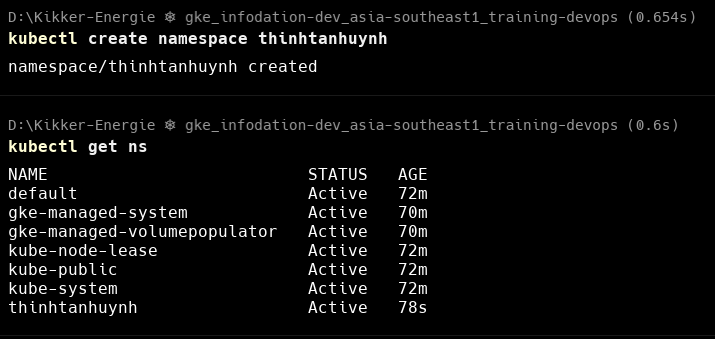
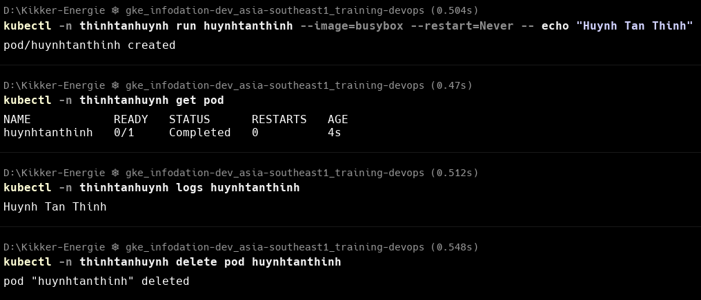
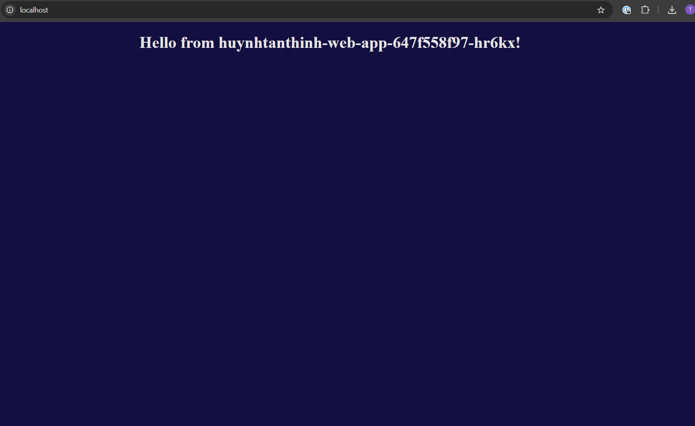
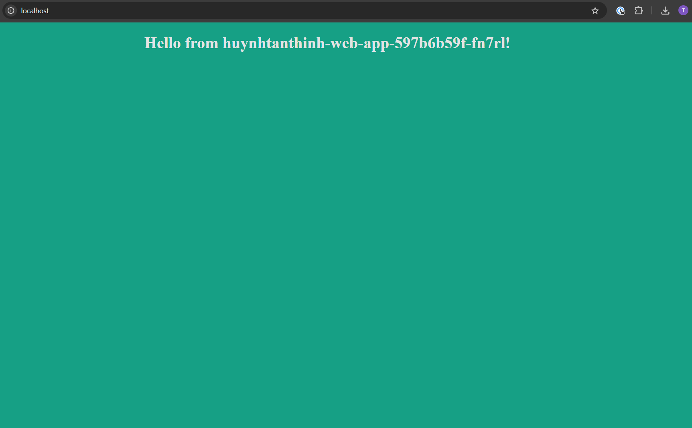
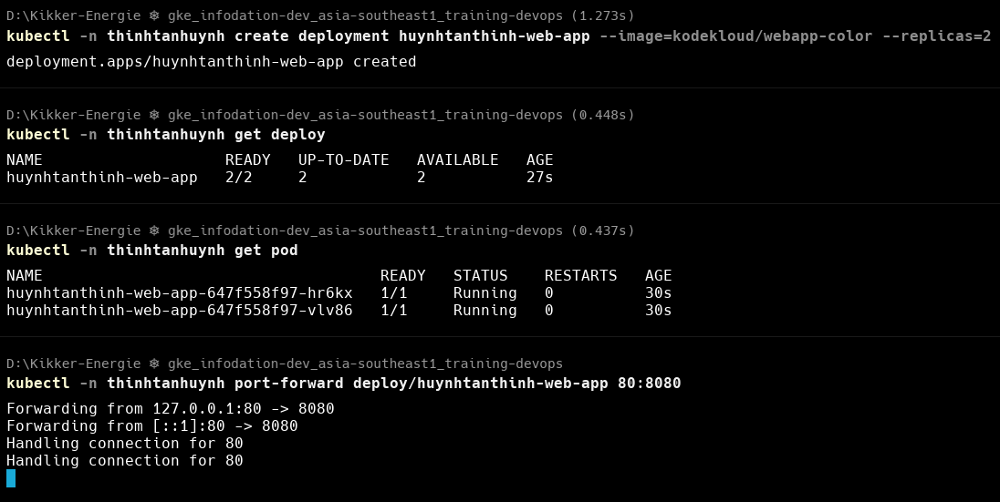
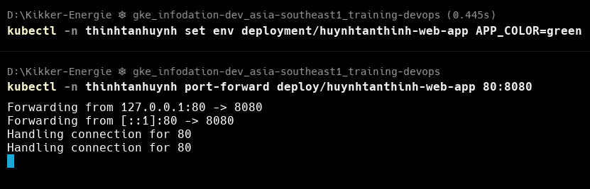
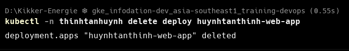
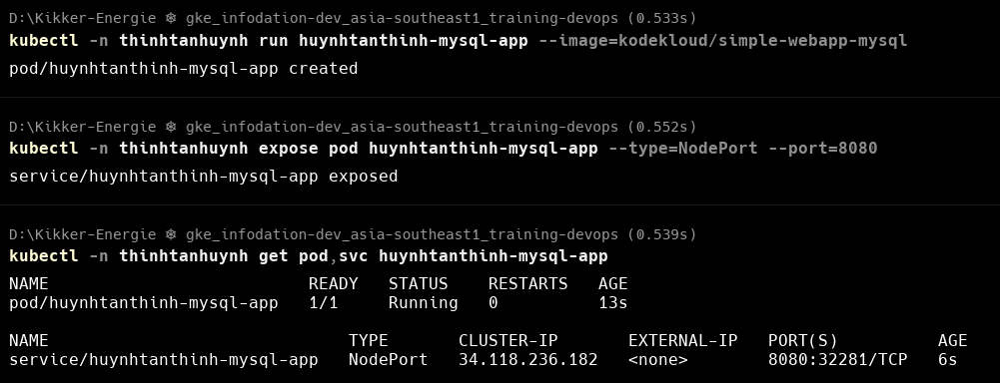
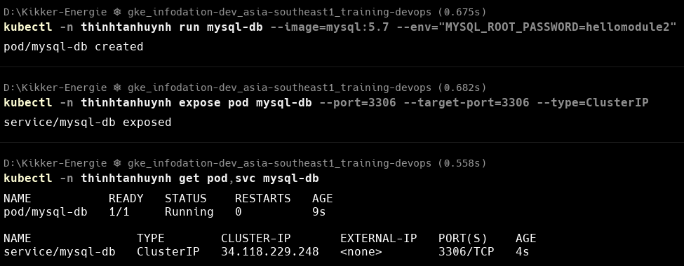
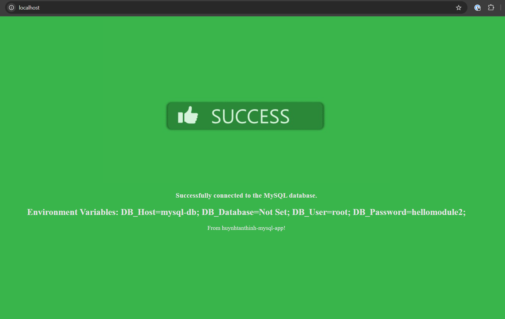

# Kubernetes Training - Module 2

## Table of Contents
- [Overview](#overview)
- [Homework 0: Basic Pod Operations](#homework-0-basic-pod-operations)
- [Homework 1: Deployment Management](#homework-1-deployment-management)
- [Homework 2: Deployment and Service Management](#homework-2-deployment-and-service-management)

## Overview
This module covers fundamental Kubernetes operations including creating namespaces, pods, and deployments. The exercises demonstrate how to manage containerized applications in a Kubernetes cluster.

## Homework 0: Basic Pod Operations

### Requirements
- Create your own namespace
- Create a pod with image busybox to print out your name
  - Check the logs
  - Display command output
  - Show the result
  - Clean up resources

### Solution

#### 1. Create a namespace
```bash
kubectl create namespace thinhtanhuynh
```

<details>
  <summary>Command Output (Click to expand)</summary>
  
  
</details>

#### 2. Create a pod with busybox to print your name
```bash
kubectl -n thinhtanhuynh run huynhtanthinh --image=busybox --restart=Never -- echo "Huynh Tan Thinh"
```

#### 3. Verify pod creation
```bash
kubectl -n thinhtanhuynh get pod
```

#### 4. Check pod logs
```bash
kubectl -n thinhtanhuynh logs huynhtanthinh
```

#### 5. Clean up resources
```bash
kubectl -n thinhtanhuynh delete pod huynhtanthinh
```

<details>
  <summary>Command Output (Click to expand)</summary>
  
  
</details>

## Homework 1: Deployment Management

### Requirements
- Create your own deployment: `<your-full-name>-web-app` with image: `kodekloud/webapp-color` with 2 replicas
- Change application color to green
  - List commands used
  - Show the result before and after changing color
  - Clean up resources

### Solution

#### 1. Create a web app deployment with 2 replicas
```bash
kubectl -n thinhtanhuynh create deployment huynhtanthinh-web-app --image=kodekloud/webapp-color --replicas=2
```

#### 2. Verify deployment creation
```bash
# Check deployment status
kubectl -n thinhtanhuynh get deploy

# Check pod status
kubectl -n thinhtanhuynh get pod
```

#### 3. Access the application
```bash
kubectl -n thinhtanhuynh port-forward deploy/huynhtanthinh-web-app 80:8080
```

<details>
  <summary>Initial Application View (Click to expand)</summary>
  
  
</details>

#### 4. Change application color to green
```bash
kubectl -n thinhtanhuynh set env deployment/huynhtanthinh-web-app APP_COLOR=green
```

#### 5. Access the application after color change
```bash
kubectl -n thinhtanhuynh port-forward deploy/huynhtanthinh-web-app 80:8080
```

<details>
  <summary>Final Application View (Click to expand)</summary>
  
  
</details>

#### 6. Clean up resources
```bash
kubectl -n thinhtanhuynh delete deploy huynhtanthinh-web-app
```

<details>
  <summary>Command Execution Screenshots (Click to expand)</summary>
  
  
  
  
</details>


## Homework 2: Deployment and Service Management

### Requirements
1. Create your own pod: <your-full-name>-mysql-app with image kodekloud/simple-webapp-mysql, expose using NodePort
2. Create a mysql database pod with password: hellomodule2 and expose using ClusterIP
3. Connect 2 service to each other 
    - List the command using
    - Show the result in step 1 & 3
    - Clean up


### Solution

#### 1. Create a web-app pod with image kodekloud/simple-webapp-mysql
```bash
kubectl -n thinhtanhuynh run huynhtanthinh-mysql-app --image=kodekloud/simple-webapp-mysql
```

#### 2. Expose the web-app pod using NodePort
```bash
kubectl -n thinhtanhuynh expose pod huynhtanthinh-mysql-app --type=NodePort --port=8080
```

#### 3. Verify web-app pod and service creation
```bash
kubectl -n thinhtanhuynh get pod,svc huynhtanthinh-mysql-app
```

<details>
  <summary>Command output (Click to expand)</summary>
  
  
</details>

#### 4. Create a MySQL pod with root password
```bash
kubectl -n thinhtanhuynh run mysql-db --image=mysql:5.7 --env="MYSQL_ROOT_PASSWORD=hellomodule2"
```

#### 5. Expose the MySQL pod using ClusterIP
```bash
kubectl -n thinhtanhuynh expose pod mysql-db --port=3306 --target-port=3306 --type=ClusterIP
```

#### 6. Verify MySQL pod and service creation
```bash
kubectl -n thinhtanhuynh get pod,svc mysql-db
```

<details>
  <summary>Command output (Click to expand)</summary>
  
  
</details>

#### 7. Create a new secret for web-app pod
```bash
kubectl -n thinhtanhuynh create secret generic mysql-credentials --from-literal=DB_Host=mysql-db --from-literal=DB_User=root --from-literal=DB_Password=hellomodule2
```

#### 8. Recreate web-app pod with environment variables
NOTE: Because we can't update the environment variables in a running pod, we need to delete and recreate it with environment variables from the secret.
```bash
# Delete the pod
kubectl -n thinhtanhuynh delete pod huynhtanthinh-mysql-app

# Recreate the pod with env from secret
kubectl -n thinhtanhuynh run huynhtanthinh-mysql-app --image=kodekloud/simple-webapp-mysql --overrides='{"spec":{"containers":[{"name":"huynhtanthinh-mysql-app","image":"kodekloud/simple-webapp-mysql","env":[{"name":"DB_Host","valueFrom":{"secretKeyRef":{"name":"mysql-credentials","key":"DB_Host"}}},{"name":"DB_User","valueFrom":{"secretKeyRef":{"name":"mysql-credentials","key":"DB_User"}}},{"name":"DB_Password","valueFrom":{"secretKeyRef":{"name":"mysql-credentials","key":"DB_Password"}}}]}]}}'
```

#### 9. Clean up resources
```bash
kubectl -n thinhtanhuynh delete pod,svc huynhtanthinh-mysql-app mysql-db
```

<details>
  <summary>Application view (Click to expand)</summary>
  
  
</details>